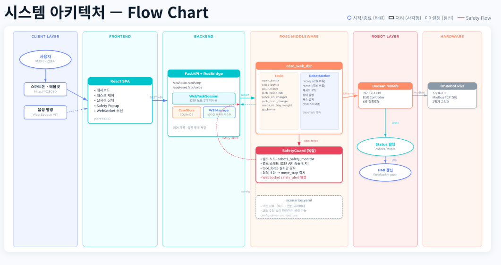
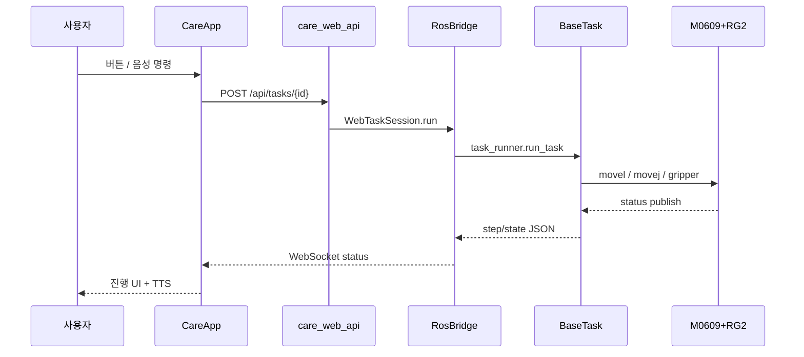
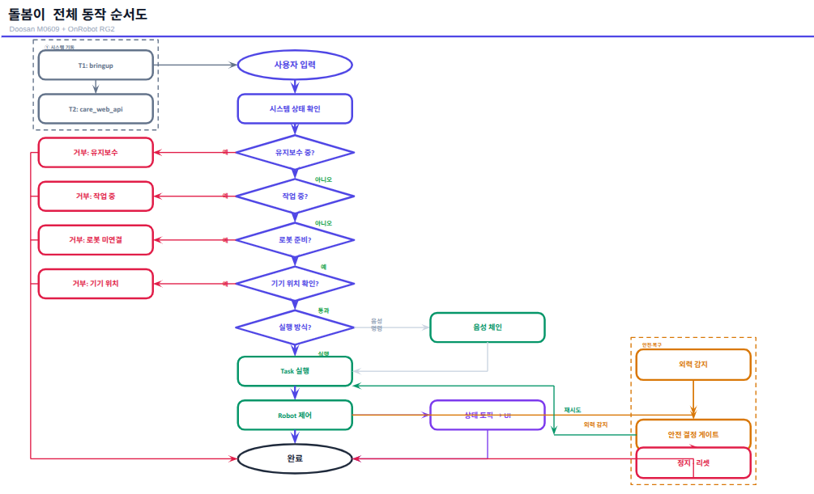
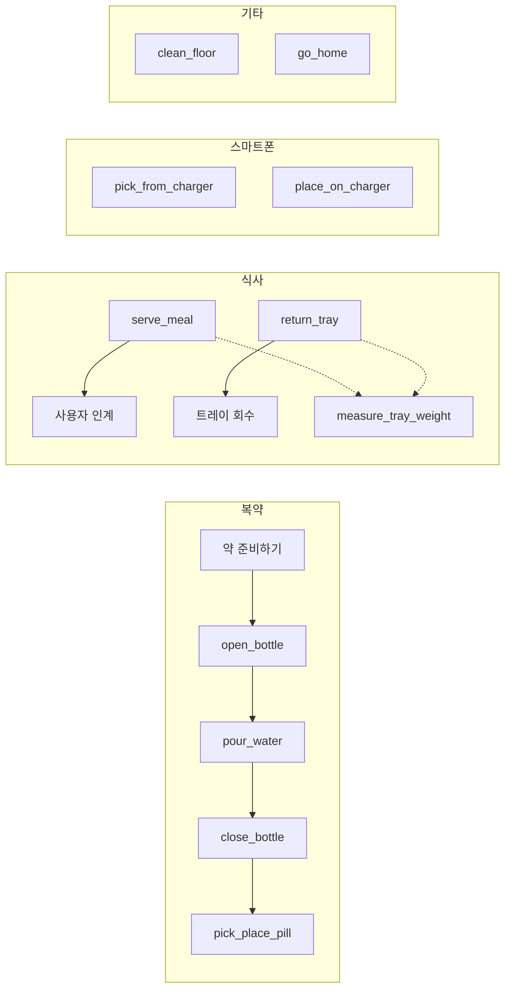
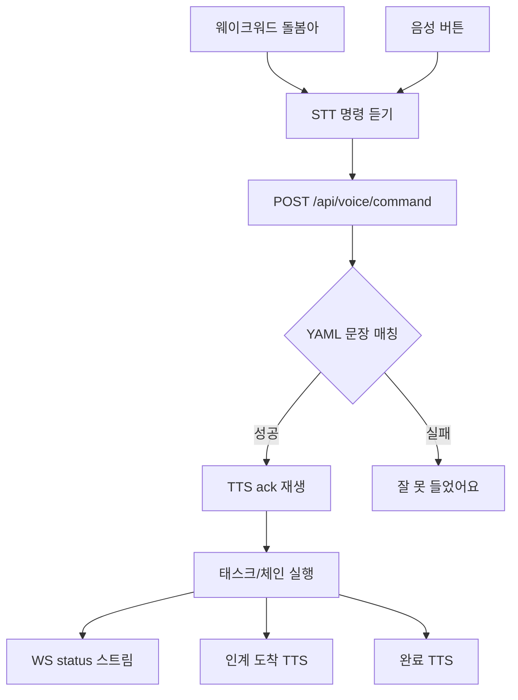
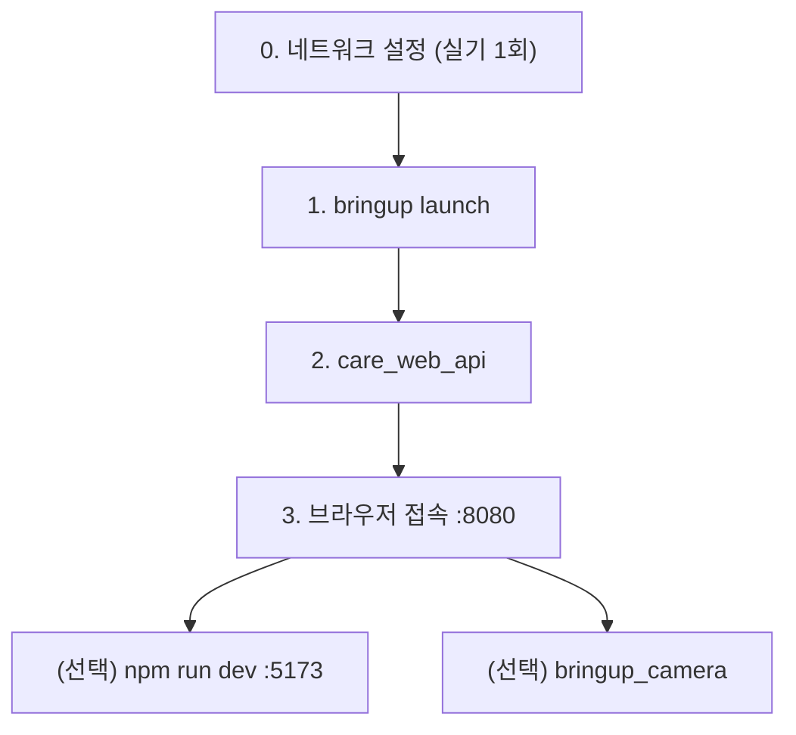

# 돌봄이 — 침상에서 생활하는 노인/환자를 위한 보조 로봇 (Doosan M0609)

노인·환자 보조를 위한 ROS 2 패키지입니다. Doosan **M0609** 협동로봇과 OnRobot **RG2** 그리퍼로 복약·식사·스마트폰·청소 등 침상 케어 동작을 수행하고, **모바일 웹 UI**와 **음성 명령**으로 원격 제어할 수 있습니다.

---

## 목차

1. [시스템 설계](#1-시스템-설계)
2. [플로우 차트](#2-플로우-차트)
3. [운영 환경](#3-운영-환경)
4. [사용 장비 목록](#4-사용-장비-목록)
5. [의존성](#5-의존성)
6. [설치](#6-설치)
7. [실행 순서 (Launch · Script)](#7-실행-순서-launch--script)
8. [주요 기능 · 태스크](#8-주요-기능--태스크)
9. [설정 파일](#9-설정-파일)
10. [음성 인식 · TTS](#10-음성-인식--tts)
11. [관리자 웹](#11-관리자-웹)
12. [패키지 구조](#12-패키지-구조)
13. [트러블슈팅](#13-트러블슈팅)

---

## 1. 시스템 설계

3계층 구조로 동작합니다. **로봇 제어(ROS 2)** · **웹 브릿지(FastAPI)** · **프론트엔드(React)** 가 WebSocket/HTTP로 연결됩니다.

### 시스템 아키텍처



> 파일: [`docs/system_architecture.png`](docs/system_architecture.png)

클라이언트(태블릿·음성) → React SPA → FastAPI/RosBridge → ROS 2 태스크·SafetyGuard → Doosan M0609 + OnRobot RG2 로 이어지는 계층 구조입니다. `scenarios.yaml` 기반 설정 주도 아키텍처로, 좌표·속도 변경 시 코드 수정 없이 동작을 조정할 수 있습니다.

### 데이터 흐름 (태스크 실행)



### 설계 원칙

| 항목 | 내용 |
|------|------|
| 태스크 실행 | `care_web_api`가 DSR 세션을 유지하며 `WebTaskSession`으로 태스크 실행 (터미널 `ros2 run`과 동일 로직) |
| 모션 추상화 | 태스크 → `RobotMotion` (`move_task_pose`, `movej_joint`, `probe_down` 등) → DSR `movel`/`movej` |
| 안전 | 백그라운드 외력 감시, 외력 시 일시정지/중단, `move_stop` + 홈 복귀 |
| 상태 공유 | `~/.cobot1/*.json` (뚜껑 위치, 핸드폰/트레이 위치), SQLite `care.db` / `events.db` |
| 설정 | `config/scenarios.yaml` 티칭 좌표·속도, `config/voice_commands.yaml` 음성·TTS |

---

## 2. 플로우 차트

### 2.1 돌봄이 전체 동작 순서도



> 파일: [`docs/flowchart.png`](docs/flowchart.png)

시스템 기동(bringup → care_web_api) 후 사용자 입력(웹·음성)을 받고, 유지보수/작업 중/로봇 준비/기기 위치를 검사한 뒤 태스크를 실행합니다. 외력 감지 시 안전 결정 게이트를 통해 재시도·정지·리셋으로 분기합니다.

### 2.2 케어 기능 흐름



### 2.3 웹 · 음성 · 로봇 연동



---

## 3. 운영 환경

| 항목 | 권장 / 검증 환경 |
|------|------------------|
| **OS** | Ubuntu **22.04 LTS** (Jammy) |
| **ROS 2** | **Humble** Hawksbill |
| **Python** | **3.10+** |
| **Node.js** | **16+** (웹 UI 빌드, Vite 2.x) |
| **브라우저** | Chrome / Edge (Web Speech API, WebSocket) |
| **네트워크** | PC 유선 `192.168.1.10/24`, 로봇 `192.168.1.100` |
| **ROS_DOMAIN_ID** | **`41`** (모든 터미널·launch 동일 필수) |
| **Docker** | virtual 모드 bringup 시 DRCF 에뮬레이터용 |

### bashrc 권장 설정

```bash
export ROS_DOMAIN_ID=41
source /opt/ros/humble/setup.bash
source ~/ros2_ws/install/setup.bash
export PYTHONPATH=$PYTHONPATH:~/ros2_ws/install/dsr_common2/lib/dsr_common2/imp
```

---

## 4. 사용 장비 목록

| 구분 | 모델 / 사양 | 용도 | 비고 |
|------|-------------|------|------|
| 협동로봇 | **Doosan M0609** | 팔 manipulator | Programming Manual V3.4.0, IP `192.168.1.100` |
| 그리퍼 | **OnRobot RG2** | 병뚜껑·알약·핸드폰·식판·걸레 파지 | Modbus TCP `192.168.1.1:502`, changer addr `65` |
| 제어 PC | Ubuntu PC (유선 LAN) | ROS 2 + 웹 API + UI | `scripts/set_robot_network.sh`로 IP 설정 |
| 클라이언트 | 태블릿 / 스마트폰 | CareApp 웹 UI | Wi-Fi 또는 `adb reverse tcp:8080` |
| 카메라 (선택) | **Intel RealSense** | 관리자 모니터링 | `bringup_camera.launch.py` |
| 주변 물체 | 페트병·컵·컵홀더·알약 서랍·무선충전기·식판·걸레 | 태스크별 픽스처 | `scenarios.yaml` 티칭 좌표 |

### 소프트웨어 스택 (로봇 측)

| 패키지 | 역할 |
|--------|------|
| `dsr_common2`, `dsr_msgs2`, `dsr_bringup2`, `dsr_description2` | Doosan ROS 2 드라이버 |
| `m0609_rg2_bringup` | M0609 + RG2 URDF, bringup launch |
| `onrobot_rg_control` | real 모드 RG2 Modbus 드라이버 (bringup 포함) |
| `cobot1` | 케어 태스크, 웹 API, UI |

---

## 5. 의존성

### 5.1 ROS 2 패키지 (`package.xml`)

- `rclpy`, `std_msgs`, `std_srvs`
- `dsr_msgs2`, `onrobot_rg_msgs`
- `ament_index_python`, `python3-yaml`

### 5.2 Python (태스크 · ROS)

- `PyYAML` — `scenarios.yaml` 로드
- DSR Python API — `dsr_common2/lib/dsr_common2/imp` (`PYTHONPATH` 필수)

### 5.3 Python (웹 API, `requirements-web.txt`)

```
fastapi>=0.110.0
uvicorn[standard]>=0.27.0
edge-tts>=6.1.0
```

### 5.4 Node.js (웹 UI, `web/package.json`)

- React 18, React Router 6, Vite 2.9

### 5.5 워크스페이스 패키지 (별도 `src` 설치)

```
~/ros2_ws/src/
├── cobot1/                 # 이 패키지
├── cobot_rg2/
│   ├── m0609_rg2_bringup/
│   └── ...
├── doosan-ros2/            # dsr_common2, dsr_bringup2 등
└── onrobot_rg_control/     # RG2 bringup 드라이버
```

---

## 6. 설치

### 6.1 ROS 2 Humble

[공식 설치 가이드](https://docs.ros.org/en/humble/Installation/Ubuntu-Install-Debians.html) 참고.

### 6.2 워크스페이스 빌드

```bash
cd ~/ros2_ws
source /opt/ros/humble/setup.bash
export PYTHONPATH=$PYTHONPATH:~/ros2_ws/install/dsr_common2/lib/dsr_common2/imp

# 의존성 (가능한 경우)
rosdep install --from-paths src --ignore-src -r -y

# 웹 UI 빌드
cd ~/ros2_ws/src/cobot1/web
npm install
npm run build

# cobot1 + bringup 빌드
cd ~/ros2_ws
colcon build --symlink-install
source install/setup.bash
```

### 6.3 Python 웹 의존성

```bash
pip3 install --user -r ~/ros2_ws/src/cobot1/requirements-web.txt
```

`run_care_web_api.sh` 실행 시 FastAPI·edge-tts 미설치면 자동 설치를 시도합니다.

### 6.4 로봇 네트워크 (실기)

```bash
sudo ~/ros2_ws/src/cobot1/scripts/set_robot_network.sh
ping 192.168.1.100
```

팬던트에서 **SERVO ON**, 알람 해제 후 진행합니다.

---

## 7. 실행 순서 (Launch · Script)

**반드시 아래 순서**로 기동합니다. `ROS_DOMAIN_ID=41`은 모든 터미널에서 동일해야 합니다.



### Step 0 — 네트워크 (실기, 최초 1회)

```bash
sudo ~/ros2_ws/src/cobot1/scripts/set_robot_network.sh
```

### Step 1 — 로봇 Bringup (터미널 1, 필수)

**스크립트:**

```bash
~/ros2_ws/src/cobot1/scripts/run_bringup.sh
# 또는
export ROS_DOMAIN_ID=41
source ~/ros2_ws/install/setup.bash
ros2 launch m0609_rg2_bringup bringup.launch.py mode:=real host:=192.168.1.100
```

| Launch 인자 | 설명 |
|-------------|------|
| `mode:=real` | 실제 로봇 (`virtual` = DRCF 에뮬레이터) |
| `host:=192.168.1.100` | 로봇 IP |

> **주의:** `model:=real` 이 아니라 **`mode:=real`** 입니다.

**기동 확인:** 로그에 `Configured and activated dsr_controller2` 표시까지 대기.

**virtual 모드 (로봇 없이 개발):**

```bash
ros2 launch m0609_rg2_bringup bringup.launch.py mode:=virtual
```

**카메라 포함 (관리자 모니터링, 선택):**

```bash
ros2 launch m0609_rg2_bringup bringup_camera.launch.py mode:=real host:=192.168.1.100
```

### Step 2 — 웹 API + UI (터미널 2, 필수)

```bash
~/ros2_ws/src/cobot1/scripts/run_care_web_api.sh
```

- FastAPI + React 빌드 산출물(`web/dist`) 서빙
- 포트 **8080**
- `care_web_api` 미빌드 시 자동 `colcon build --packages-select cobot1`

### Step 3 — 브라우저 접속

| 대상 | URL |
|------|-----|
| 케어 UI | `http://<PC_IP>:8080` |
| 관리자 | `http://<PC_IP>:8080/admin` |
| 태블릿 USB (`adb reverse`) | `http://127.0.0.1:8080` |

```bash
adb reverse tcp:8080 tcp:8080
```

### Step 4 — (선택) React 개발 서버

UI 수정 시 핫리로드:

```bash
cd ~/ros2_ws/src/cobot1/web
npm run dev
# http://<PC_IP>:5173  (API는 8080으로 프록시)
```

> **운영 시** `npm run build` 후 `care_web_api` 재시작. `5173`만 쓰면 API(8080)가 없을 수 있습니다.

### Step 5 — (선택) CLI 단독 태스크

bringup + `source install/setup.bash` 후:

```bash
export PYTHONPATH=$PYTHONPATH:~/ros2_ws/install/dsr_common2/lib/dsr_common2/imp
ros2 run cobot1 open_bottle
ros2 run cobot1 close_bottle
ros2 run cobot1 pour_water
ros2 run cobot1 pick_place_pill
ros2 run cobot1 serve_meal
ros2 run cobot1 return_tray
ros2 run cobot1 pick_from_charger
ros2 run cobot1 place_on_charger
ros2 run cobot1 clean_floor
ros2 run cobot1 go_home
```

웹 버튼 = 위 `ros2 run cobot1 <태스크>` 와 동일합니다.

### scripts 요약

| 스크립트 | 용도 |
|----------|------|
| [`scripts/run_bringup.sh`](scripts/run_bringup.sh) | M0609 + RG2 bringup |
| [`scripts/run_care_web_api.sh`](scripts/run_care_web_api.sh) | 웹 API + UI (메인 운영) |
| [`scripts/run_care_web.sh`](scripts/run_care_web.sh) | 실행 순서 안내 출력 |
| [`scripts/set_robot_network.sh`](scripts/set_robot_network.sh) | PC 유선 IP `192.168.1.10` 설정 |

---

## 8. 주요 기능 · 태스크

### 웹 UI 버튼 (`CareApp`)

| UI | 태스크 | 설명 |
|----|--------|------|
| **약 준비하기** | `prepare_medication` (체인) | `open_bottle` → `pour_water` → `close_bottle` → `pick_place_pill` |
| **식사 가져오기** | `serve_meal` | 식판 station → 사용자 인계 (무게 측정 포함) |
| **식사 가져가기** | `return_tray` | 사용자 → station 회수 (섭취율 측정) |
| **핸드폰 가져오기** | `pick_from_charger` | 충전기 → 사용자 |
| **핸드폰 가져다놓기** | `place_on_charger` | 사용자 → 충전기 |
| **청소하기** | `clean_floor` | 걸레 파지 → 바닥 닦기 → 복귀 |
| **기본 위치 복귀** | `go_home` | home 조인트 복귀 |

### 등록 태스크 전체 (`setup.py` entry_points)

| CLI | 구현 | 비고 |
|-----|------|------|
| `open_bottle` | `tasks/open_bottle.py` | 뚜껑 개봉, 바닥 포즈 저장 |
| `close_bottle` | `tasks/close_bottle.py` | 뚜껑 닫기, 물병 복귀 |
| `pour_water` | `tasks/pour_water.py` | J6 기울여 따르기 |
| `pick_place_pill` | `tasks/pick_place_pill.py` | 서랍 → 복약 위치 |
| `pick_from_charger` / `place_on_charger` | `tasks/pick_*.py` | 조인트 티칭 경로 |
| `serve_meal` / `return_tray` | `tasks/serve_meal.py` 등 | 식판 + handoff |
| `measure_tray_weight` | `tasks/measure_tray_weight.py` | tool force Z 섭취율 |
| `calibrate_tray_tare` | `tasks/calibrate_tray_tare.py` | 식판 공차 보정 |
| `clean_floor` | `tasks/clean_floor.py` | 걸레 닦기 |
| `go_home` | `tasks/go_home.py` | 홈 복귀 |
| `care_web_api` | `bridge/api_server.py` | 웹 브릿지 (운영 진입점) |

### 안전 · 제어

- 동작 중 **외력 감지** → 로봇 정지 + 웹 주의 팝업
- **정지** 버튼 → `move_stop` + 그리퍼 열기 + 홈 복귀
- 실행 중 UI 잠금 + 하단 **실행 중 바** (단계 한글 라벨)
- **사용자 인계(handoff)** → nudge + 그리퍼 열림 대기

---

## 9. 설정 파일

| 파일 | 내용 |
|------|------|
| [`config/scenarios.yaml`](config/scenarios.yaml) | 티칭 좌표, 속도, 안전, 그리퍼 Modbus |
| [`config/voice_commands.yaml`](config/voice_commands.yaml) | 음성 명령 문장, TTS 멘트, 체인 정의 |
| [`config/grasp_objects.yaml`](config/grasp_objects.yaml) | 파지 검증 (gwdf 임계값) |
| [`config/care.yaml`](config/care.yaml) | 케어 사용자, 일일 목표 |

환경 변수로 설정 경로 변경:

```bash
export COBOT1_CONFIG=/path/to/my_scenarios.yaml
```

런타임 상태 (`~/.cobot1/`):

| 파일 | 용도 |
|------|------|
| `cap_place_pose.json` | `open_bottle` → `close_bottle` 뚜껑 위치 |
| `phone_location.json` | 핸드폰 위치 (충전기 / 사용자) |
| `tray_location.json` | 식판 위치 |
| `tray_tare.json` / `tray_weight_session.json` | 식사량 측정 |
| `care.db` | 케어 기록 |
| `events.db` | 실행·감사 이벤트 |

---

## 10. 음성 인식 · TTS

| 구분 | 기술 | 위치 |
|------|------|------|
| STT | Web Speech API (`ko-KR`) | 브라우저 |
| 명령 해석 | YAML 고정 문장 **완전 일치** | `voice_intent.py` |
| TTS | edge-tts → MP3 → HTML Audio | 서버 생성 + 브라우저 재생 |
| 웨이크워드 | 「돌봄아」 상시 감지 | `useWakeWordListener.js` |

**음성 명령 예:** 「약 준비해 줘」, 「핸드폰 가져다줘」, 「식사 가져와줘」, 「멈춰」, 「청소해줘」

API: `GET /api/voice/catalog`, `POST /api/voice/command`, `POST /api/tts`

---

## 11. 관리자 웹

`http://<PC_IP>:8080/admin`

| 메뉴 | 기능 |
|------|------|
| 대시보드 | 로봇 상태, 카메라 모니터 |
| 실시간 로그 | WebSocket 로그 |
| 실행 이력 | `events.db` 기반 run history |
| 안전 센터 | 외력·알람 이벤트 |
| 사용자 케어 | 복약·식사 목표, 기록 |
| 감사 로그 | 관리자 작업 audit |

---

## 12. 패키지 구조

```
cobot1/
├── config/
│   ├── scenarios.yaml          # 좌표·동작·안전
│   ├── voice_commands.yaml     # 음성·TTS
│   ├── grasp_objects.yaml
│   └── care.yaml
├── cobot1/
│   ├── tasks/                  # 케어 태스크 (open_bottle, serve_meal, …)
│   ├── motion/                 # RobotMotion, 안전, 그리퍼, RG2 Modbus
│   ├── bridge/                 # api_server, voice, care_store, handoff
│   ├── nodes/care_server.py    # (선택) ROS2 서비스 서버
│   └── task_runner.py          # 태스크 등록·실행
├── web/                        # React CareApp + AdminApp
│   ├── src/
│   └── dist/                   # npm run build → colcon에 포함
├── scripts/                    # bringup, web API, 네트워크
├── test/
├── requirements-web.txt
├── setup.py
└── README.md
```

---

## 13. 트러블슈팅

| 증상 | 확인 |
|------|------|
| `Package 'cobot1' not found` | `source ~/ros2_ws/install/setup.bash` |
| `No executable found` (care_web_api) | `colcon build --packages-select cobot1` 후 재시작 |
| `Set Robot Mode Service is not available` | bringup 실행, `ROS_DOMAIN_ID=41` 통일 |
| bringup 인자 오류 | **`mode:=real`** 사용 (`model:=real` 아님) |
| 웹에 예전 UI | `npm run build` → `care_web_api` 재시작 → Ctrl+Shift+R |
| 두 번째 태스크 실패 | `care_web_api` 최신 (DSR 세션 유지) |
| 음성 인식 안 됨 | Chrome/Edge, 마이크 권한, `http://` 또는 localhost |
| 태블릿 접속 불가 | PC Wi-Fi IP 사용 (유선 IP 아님) 또는 `adb reverse` |
| 그리퍼 무반응 | RG2 Modbus IP `192.168.1.1`, bringup RG2 드라이버 확인 |

---

## 라이선스

Apache-2.0
